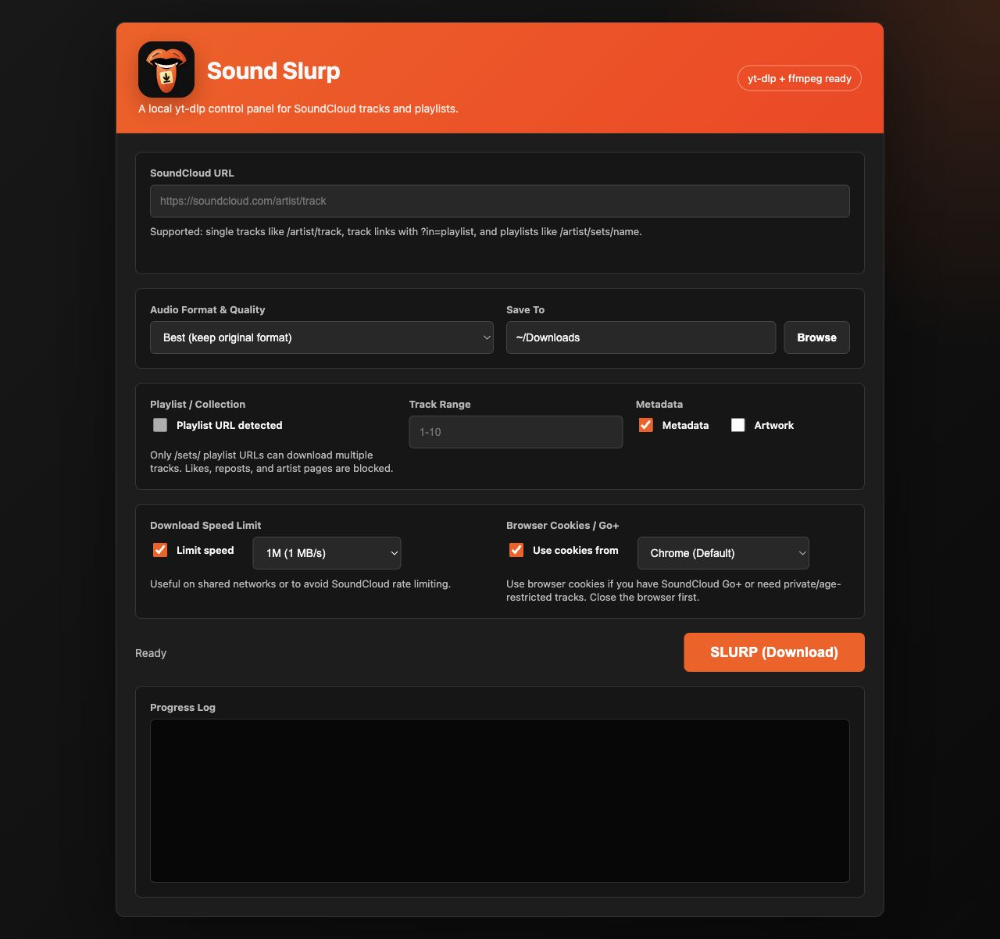

# Sound Slurp


A small macOS app wrapper around [yt-dlp](https://github.com/yt-dlp/yt-dlp) for downloading SoundCloud tracks and playlists.

It runs a local control panel in your browser at `http://127.0.0.1:8765/`, with a SoundCloud-inspired interface and live download logs.

> This is an alpha made for friends. It is not affiliated with SoundCloud. Use it responsibly and only download media you have rights or permission to save.



## Features

- SoundCloud URL detection for single tracks and `/sets/` playlists
- Track links with playlist context, such as URLs containing `?in=...`
- Best original audio by default
- Optional MP3, FLAC, and OGG conversion through ffmpeg
- Playlist range support, such as `1-10` or `5-5`
- Metadata and artwork embedding
- Download speed limiting
- Browser cookie support for SoundCloud Go+, private, or age-restricted tracks
- Local-only web UI with live yt-dlp output

## Quick Install

Clone or download this repo, then run:

```bash
./install.sh
```

The installer downloads `yt-dlp_macos` and `ffmpeg`, builds the app wrapper, and installs:

```text
/Applications/Sound Slurp.app
```

Open the app from Applications. If a browser tab does not appear, open:

```text
http://127.0.0.1:8765/
```

## Cookies

Use browser cookies if you have **SoundCloud Go+**. Go+ access, private tracks, and age-restricted tracks may depend on your logged-in browser session.

1. Log into SoundCloud in your browser.
2. Close that browser.
3. Leave **Use cookies from** enabled in the app.
4. Pick the profile where you are logged in, usually **Chrome (Default)**.

The app does not store or upload cookies. It passes the selected browser profile to yt-dlp locally.

## Supported URLs

The app intentionally supports only:

- Single tracks: `https://soundcloud.com/artist/track`
- Single track links with playlist context appended, such as `?in=artist/sets/playlist`
- Playlists/sets: `https://soundcloud.com/artist/sets/playlist`

The app blocks whole artist pages, likes pages, and reposts pages. Those pages can contain thousands of tracks and are too easy to start accidentally.

## Quality Notes

The default **Best (keep original format)** option is usually the safest choice. If SoundCloud only serves a compressed AAC stream, converting it to MP3 320 will not improve the source quality.

## Development

Run the web app locally:

```bash
./scripts/run_dev.sh
```

Rebuild the macOS app:

```bash
./scripts/build_app.sh --download --open
```

Install somewhere other than `/Applications`:

```bash
APP_PATH="$HOME/Desktop/Sound Slurp.app" ./scripts/build_app.sh --download
```

## Troubleshooting

See [docs/troubleshooting.md](docs/troubleshooting.md).
